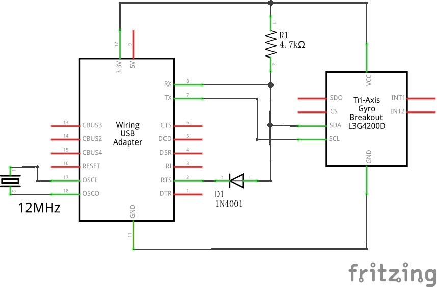

# tinyboard-tools
support i2c tools and spi tools etc.
>  Note: extrenal crystal or oscillator is necessary!

## Connect FT232RL with i2c device


## Builld
1. Windows
```
>premake4 gmake
>make
```

## i2cdetect (GY-91)
```
PS ~> .\i2cdetect.exe 0
     0  1  2  3  4  5  6  7  8  9  a  b  c  d  e  f
00:          -- -- -- -- -- -- -- -- -- -- -- -- --
10: -- -- -- -- -- -- -- -- -- -- -- -- -- -- -- --
20: -- -- -- -- -- -- -- -- -- -- -- -- -- -- -- --
30: -- -- -- -- -- -- -- -- -- -- -- -- -- -- -- --
40: -- -- -- -- -- -- -- -- -- -- -- -- -- -- -- --
50: -- -- -- -- -- -- -- -- -- -- -- -- -- -- -- --
60: -- -- -- -- -- -- -- -- 68 -- -- -- -- -- -- --
70: -- -- -- -- -- -- 76 --
```

## i2cdump
```
PS ~> .\i2cdump.exe 0 0x68
     0  1  2  3  4  5  6  7  8  9  a  b  c  d  e  f
00: c5 ce e0 0e a0 17 25 cf fa f0 fb fd 00 5a 5b 77
10: bf b9 a5 00 00 00 00 00 00 00 00 00 00 00 00 00
20: 00 00 00 00 00 00 00 00 00 00 00 00 00 00 00 00
30: 00 00 00 00 00 00 00 00 00 00 01 e3 9c e3 7c cd
40: 6c fa 60 ff 1f 00 3b ff f0 00 00 00 00 00 00 00
50: 00 00 00 00 00 00 00 00 00 00 00 00 00 00 00 00
60: 00 00 00 00 00 00 00 00 00 00 00 01 00 00 1f 89
70: 00 00 00 00 00 71 00 15 fa 00 eb 12 00 22 82 00
80: c5 ce e0 0e a0 17 25 cf fa f0 fb fd 00 5a 5b 77
90: bf b9 a5 00 00 00 00 00 00 00 00 00 00 00 00 00
a0: 00 00 00 00 00 00 00 00 00 00 00 00 00 00 00 00
b0: 00 00 00 00 00 00 00 00 00 00 01 e3 9c e3 68 cc
c0: 24 fa 80 ff 15 00 2b ff a0 00 00 00 00 00 00 00
d0: 00 00 00 00 00 00 00 00 00 00 00 00 00 00 00 00
e0: 00 00 00 00 00 00 00 00 00 00 00 01 00 00 21 22
f0: 00 00 00 00 00 71 00 15 fa 00 eb 12 00 22 82 00
```
## i2ce2prom
```


```
